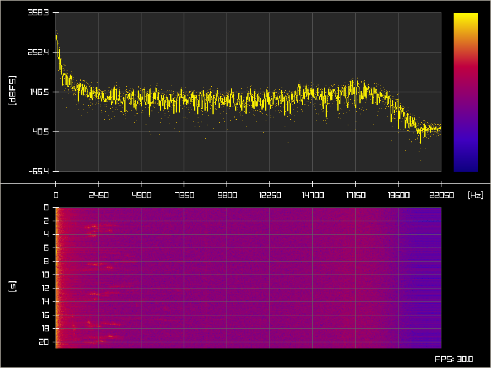

# Microphone Spectrum

Show your microphone's spectrum and a corresponding waterfall.
(The screenshot shows bird chirps.)

<div align="center">
  
</div>

# Quick Start

## [Get Odin](https://odin-lang.org/docs/install/)

## Build

```console
make release
```

*Note*: If you're using Odin's library miniaudio for the first time, running `make release` will show an error message like
```console
Error: Compile time panic: Could not find the compiled miniaudio library
```
The very same message will tell you how to compile miniaudio, something like
```console
make -C "/home/path/to/odin/download/vendor/miniaudio/src"
```
After running this command, run `make release` again and it should work.

## Start the application

```console
./mic-spectrum
```

# Font

The [font](./DMMono-Regular.ttf) is from [openfont.org](https://openfont.org/), available under MIT license.

